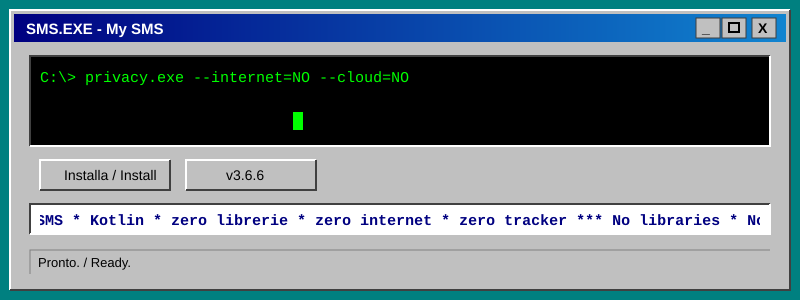

<div align="center">



# 💾 My SMS

**A personal SMS app for Android — no internet, no libraries, no trackers.**

[🇮🇹 Italiano](README.md) · 🇬🇧 English




</div>

---

## 🖥️ What is it

`My SMS` replaces the system messaging app with one written from scratch in Kotlin, using **only Android's own APIs**.
It does not have the `INTERNET` permission: the app **cannot** send anything out of your phone.

```
┌─ About My SMS ────────────────────────────── _ □ X ┐
│                                                    │
│   💬  My SMS   version 3.6.6                       │
│                                                    │
│   Free memory ........... all of it                │
│   Cloud ................. none                     │
│   Trackers .............. 0                        │
│                                                    │
│              [   OK   ]   [ Cancel ]              │
└────────────────────────────────────────────────────┘
```

## ✨ Features

| | Feature |
|---|---|
| 💬 | Conversation list with contact name, preview and time |
| 📨 | Live send and receive; long messages split automatically |
| ✅ | Per-message status: sending, sent, **delivered**, failed (tap to retry, no duplicates) |
| 🔐 | **Verification codes** detected: a «Copy code» button in the notification |
| 🔔 | Notifications with **Reply** and **Mark as read** right from the notification |
| 🔍 | Search by text, name or number |
| 🗑️ | Delete conversations and single messages · long-press to copy text |
| 🚫 | Block numbers (see «Privacy» below) |
| 🎨 | Colour themes, including a vintage bordered style |
| ⚡ | Fast list and paged loading (200 messages at a time) |
| 🧹 | Drops duplicate SMS from the carrier and marks half-finished sends as failed |

> 📵 **MMS is not supported.** When one arrives you get a notice (without content).

## 🔒 Privacy

- **No internet access**: the `INTERNET` permission is not in the manifest.
- **No backups** of app data (`allowBackup="false"`).
- **Private notifications on the lock screen**: sender, text and codes are shown only after unlocking.
- **Copied code flagged as sensitive** on the clipboard (Android 13+).
- **Blocked numbers are not stored**: only a fingerprint is kept (PBKDF2-SHA256, random salt). The «Blocked numbers» list is rebuilt from the conversations in your SMS. The fingerprint slows down anyone trying to recover the numbers, but it is not absolute protection.
- **Release APK** (not debuggable), signed with a key that is not in the repository.
- Your SMS stay in Android's system store: the app does not copy them anywhere else.

## 📥 Installing

1. Go to [**Releases**](../../releases) and download the latest `mysms-*.apk`.
2. If you have a version **older than 3.6.6**, uninstall it first (the signing key changed). Your SMS stay, since they live in the system.
3. Open the APK and allow installs from unknown sources.
4. Launch the app, grant the permissions and tap the banner at the top to make it the **default SMS app**.

> ⚠️ Many banks and services send login codes by SMS. Before trusting the app, **disable** (don't uninstall) the system messaging app so you can switch back instantly:
> ```
> adb shell pm list packages | grep -i messag
> adb shell pm disable-user --user 0 <package.name>
> ```

## 🛠️ Building

```bash
# Locally: Android Studio (JDK 17) or Gradle 8.11
gradle testDebugUnitTest assembleRelease
```

With GitHub Actions the build runs on every push. To sign with **your own** key add three repository *secrets*:

| Secret | Content |
|---|---|
| `FIRMA_BASE64` | the `.jks` keystore in base64 (`base64 -w0 firma.jks`) |
| `FIRMA_PASSWORD` | the keystore and key password |
| `FIRMA_ALIAS` | the key alias |

Without secrets the build falls back to Android's standard debug key.
To publish a version just push a tag: `git tag v3.6.6 && git push origin v3.6.6` — Actions builds and creates the release with the APK.

## 🗂️ Where to look

| What you want to change | File |
|---|---|
| Conversation list, menu, search | `MainActivity.kt` |
| A conversation (bubbles, message actions) | `ConversazioneActivity.kt` |
| What happens when an SMS arrives | `SmsDeliverReceiver.kt` |
| Notifications and their buttons | `Notifiche.kt`, `AzioniNotificaReceiver.kt` |
| Sending, status and delivery | `InvioSms.kt`, `StatoInvioReceiver.kt`, `StatoConsegnaReceiver.kt` |
| Code detection / number matching (tested) | `Codici.kt`, `Numeri.kt` |
| Themes and settings, number blocking | `Temi.kt` |

## 🧪 Tests

The tests (`app/src/test`) cover verification-code detection and number matching. JUnit is used **only** for tests and does not end up in the APK.
The parts that talk to the phone (sending, receiving, notifications) have no automated tests and must be tried on a device.

## 🗺️ Roadmap

- MMS support (photos/video): the hardest part, needs PDU parsing and carrier APN settings.
- Move to `RecyclerView` (would add a library).
- An option to show the text on the lock screen too.

<div align="center">

<sub>💾 Built to be small, honest and only yours.</sub>

</div>
